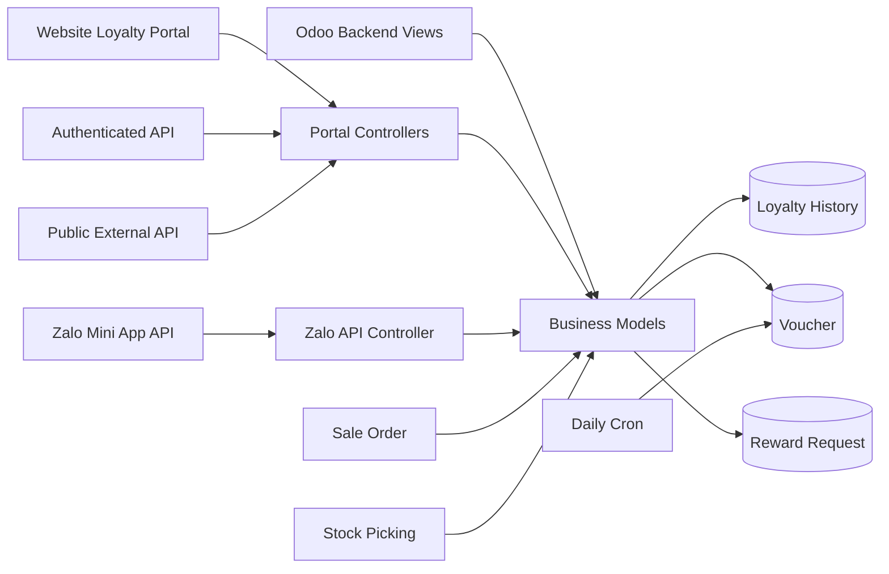
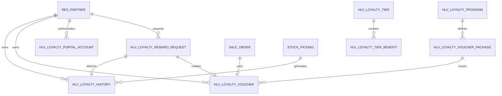
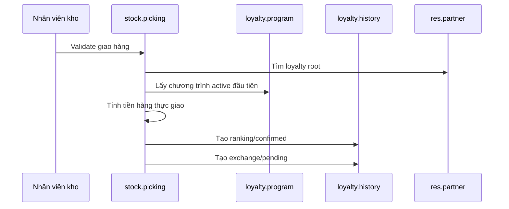

# Tài liệu chức năng và kiến trúc module `hlv_loyalty`

## 1. Tổng quan

`hlv_loyalty` là module quản lý khách hàng thân thiết tập trung cho Odoo 18, được thiết kế để phục vụ mô hình có nhiều công ty hoặc chi nhánh.

Module quản lý toàn bộ vòng đời loyalty:

- Tích điểm khi hoàn tất giao hàng.
- Tách riêng điểm xếp hạng và điểm đổi thưởng.
- Xác nhận điểm đổi thưởng trước khi cộng vào số dư khả dụng.
- Thu hồi điểm khi khách hoàn hàng toàn bộ hoặc một phần.
- Đổi điểm thành voucher, quà tặng hoặc tiền mặt.
- Áp dụng voucher trên đơn bán hàng.
- Quản lý hạng thành viên và quyền lợi.
- Cung cấp portal loyalty cho khách hàng.
- Cung cấp API nội bộ, API tích hợp ngoài và API cho Zalo Mini App.

Thông tin module:

| Thuộc tính | Giá trị |
|---|---|
| Tên kỹ thuật | `hlv_loyalty` |
| Phiên bản | `18.0.1.5.0` |
| Loại module | Application |
| Giấy phép | LGPL-3 |
| Phụ thuộc | `sale_management`, `stock`, `mail`, `website` |

## 2. Phạm vi chức năng

### 2.1. Hai loại điểm loyalty

Module không dùng một số dư điểm duy nhất mà tách thành hai loại:

| Loại điểm | Mã kỹ thuật | Mục đích | Cách xác nhận |
|---|---|---|---|
| Điểm xếp hạng | `ranking` | Xác định hạng thành viên | Tự động xác nhận khi giao hàng |
| Điểm đổi thưởng | `exchange` | Đổi voucher hoặc tiền mặt | Tạo ở trạng thái chờ, nhân viên xác nhận |

Số dư điểm không được lưu và sửa trực tiếp trên khách hàng. Các trường điểm trên `res.partner` được tính từ sổ giao dịch `hlv.loyalty.history`.

- `loyalty_total_points`: tổng điểm xếp hạng đã xác nhận.
- `loyalty_exchange_points`: tổng điểm đổi thưởng đã xác nhận.
- `loyalty_pending_points`: tổng điểm đổi thưởng đang chờ xác nhận.

Các bản ghi cũ chưa có `point_type` hoặc `state` vẫn được tính vào số dư để tương thích dữ liệu legacy.

### 2.2. Quy tắc khách hàng gốc

Điểm và voucher được quản lý tập trung tại khách hàng gốc của cây `res.partner`.

Phương thức `res.partner._get_loyalty_root()` đi ngược toàn bộ chuỗi `parent_id` đến partner cao nhất. Nhờ đó:

- Đơn hàng của contact hoặc công ty con có thể cộng điểm về công ty mẹ.
- Công ty con có thể dùng voucher thuộc công ty mẹ.
- Portal và API có thể hiển thị số dư tập trung.

Lưu ý: một số luồng cũ vẫn dùng `commercial_partner_id`, trong khi luồng tích điểm và yêu cầu đổi thưởng dùng `_get_loyalty_root()`.

## 3. Kiến trúc tổng thể



Module được chia thành các lớp:

| Lớp | Thư mục | Trách nhiệm |
|---|---|---|
| Domain/business | `models/` | Model dữ liệu, tính điểm, voucher, đổi thưởng |
| Backend UI | `views/` | Form, list, search, menu và phần mở rộng view Odoo |
| Wizard | `wizard/` | Đổi voucher, chỉnh điểm, reset mật khẩu, tính lại điểm |
| Website portal | `controllers/loyalty_public.py`, `views/loyalty_portal_*.xml` | Giao diện tự phục vụ của khách hàng |
| API loyalty | `controllers/loyalty_api.py` | API nội bộ và API tích hợp bên ngoài |
| Zalo Mini App API | `api/zalo_miniapp_api.py` | Sản phẩm, giỏ hàng, đơn hàng, địa chỉ và loyalty |
| Security | `security/` | Nhóm quyền, ACL và record rule |
| Automation/data | `data/` | Cron, sequence và dữ liệu hạng mặc định |
| Migration | `migrations/` | Chuyển đổi dữ liệu qua các phiên bản |

## 4. Mô hình dữ liệu

### 4.1. Sơ đồ quan hệ chính



### 4.2. `hlv.loyalty.program`

Chứa cấu hình cấp chương trình:

- Công ty sở hữu chương trình.
- Tỷ lệ tiền hàng sang điểm xếp hạng:
  - `earning_amount`: số tiền làm mốc quy đổi.
  - `earning_points`: số điểm nhận được tại mỗi mốc.
- Tỷ lệ tiền chiết khấu sang điểm đổi thưởng:
  - `discount_per_point`: số tiền chiết khấu tương ứng một điểm.
- Thời hạn voucher mặc định.
- Giá trị tiền mặt của một điểm đổi thưởng.
- Nội dung mô tả hiển thị trên portal.
- Danh sách gói đổi voucher.

Công thức:

```text
ranking_points =
    floor(delivered_subtotal / earning_amount) * earning_points

exchange_points =
    floor(loyalty_discount_amount / discount_per_point)
```

### 4.3. `hlv.loyalty.history`

Đây là sổ cái điểm loyalty và là nguồn dữ liệu để tính mọi số dư.

Các loại giao dịch:

| Mã | Ý nghĩa |
|---|---|
| `earn` | Tích điểm từ giao hàng hoặc API |
| `redeem` | Trừ điểm khi đổi thưởng |
| `return` | Thu hồi điểm do hoàn hàng |
| `manual` | Điều chỉnh thủ công |

Trạng thái:

| Mã | Ý nghĩa |
|---|---|
| `pending` | Chưa được cộng vào số dư khả dụng |
| `confirmed` | Được tính vào số dư |
| `cancelled` | Không được tính vào số dư |

Model lưu tham chiếu đến phiếu kho, đơn bán, voucher, chi nhánh phát sinh, chi nhánh tạo đơn và chi nhánh giao hàng để phục vụ đối soát.

### 4.4. `hlv.loyalty.voucher.package`

Định nghĩa sản phẩm đổi thưởng mà khách có thể chọn:

- Số điểm yêu cầu.
- Loại phần thưởng:
  - `discount`: giảm giá cố định hoặc phần trăm.
  - `free_shipping`: miễn phí vận chuyển.
  - `gift`: tặng sản phẩm.
- Giá trị giảm và mức giảm tối đa.
- Sản phẩm và số lượng quà tặng.
- Thời hạn voucher.
- Giá trị đơn tối thiểu.
- Phạm vi áp dụng toàn bộ sản phẩm hoặc theo danh mục.

Các constraint kiểm tra cấu hình giảm giá, phần trăm, quà tặng và số điểm.

### 4.5. `hlv.loyalty.voucher`

Là voucher đã phát hành cho một khách hàng cụ thể.

- Mã duy nhất dạng `VHQ-XXXXXX`.
- Liên kết đến gói voucher và chương trình.
- Sao chép cấu hình phần thưởng từ gói bằng related field.
- Theo dõi ngày phát hành, ngày hết hạn, đơn sử dụng và chi nhánh sử dụng.

Vòng đời:

```text
active --> used
active --> expired
active --> cancelled
```

Cron chạy mỗi ngày để chuyển voucher `active` đã quá hạn thành `expired`.

### 4.6. `hlv.loyalty.reward.request`

Quản lý yêu cầu đổi thưởng gửi từ portal hoặc API.

Hai loại yêu cầu:

- `gift`: đổi gói voucher.
- `cash`: đổi điểm thành tiền mặt, kèm thông tin ngân hàng.

Khi nhân viên hoàn tất yêu cầu:

1. Kiểm tra số dư điểm đổi thưởng.
2. Tạo giao dịch `redeem` âm và đã xác nhận.
3. Nếu đổi quà, phát hành voucher.
4. Ghi người xử lý và thời gian xử lý.

Yêu cầu đã xử lý không thể hủy.

### 4.7. `hlv.loyalty.tier` và `hlv.loyalty.tier.benefit`

Định nghĩa hạng thành viên theo ngưỡng điểm xếp hạng.

Hạng của khách hàng được chọn bằng hạng đang hoạt động có `min_points` cao nhất nhưng không vượt quá số điểm hiện tại. `max_points` hiện chủ yếu dùng để mô tả, không tham gia thuật toán chọn hạng.

Dữ liệu mặc định gồm:

- Đồng: từ 0 điểm.
- Bạc: từ 1.000 điểm.
- Vàng: từ 5.000 điểm.
- Kim cương: từ 20.000 điểm.

### 4.8. `hlv.loyalty.portal.account`

Là tài khoản đăng nhập portal loyalty độc lập với `res.users`.

- Liên kết đến khách hàng.
- Đăng nhập bằng username hoặc số điện thoại portal.
- Chuẩn hóa số điện thoại Việt Nam về dạng `0xxxxxxxxx`.
- Mật khẩu được lưu dưới dạng `salt$sha256`.
- Mật khẩu mặc định lấy từ cấu hình công ty, fallback là `hlv@2026`.

Portal lưu ID tài khoản loyalty trong session website sau khi xác thực.

### 4.9. Các model Odoo được mở rộng

#### `res.partner`

Bổ sung số dư điểm, hạng thành viên, tỷ lệ chiết khấu loyalty mặc định, lịch sử, voucher và tài khoản portal.

#### `stock.picking`

Tích điểm khi phiếu giao hàng hoàn tất và thu hồi điểm khi hoàn hàng.

#### `sale.order`

Cho phép nhập, áp dụng, gỡ và đánh dấu voucher đã sử dụng.

#### `sale.order.line`

Đánh dấu dòng phần thưởng loyalty và lưu `% CK Loyalty` dùng để tính điểm đổi thưởng. Trường này không làm thay đổi giá bán.

#### `res.company` và `res.config.settings`

Chứa cấu hình chương trình mặc định, quyền điều chỉnh điểm, thông báo và mật khẩu portal mặc định.

## 5. Các luồng nghiệp vụ chính

### 5.1. Tích điểm khi giao hàng

Điểm được tạo trong override `stock.picking.button_validate()`.

Điều kiện:

- Phiếu kho là giao hàng `outgoing`.
- Có liên kết đến Sale Order.
- Khách hàng gốc có ít nhất một tài khoản portal đang hoạt động.
- Có ít nhất một chương trình loyalty đang hoạt động.
- Phiếu chưa có lịch sử `earn`.

Luồng xử lý:



Điểm đổi thưởng được tính từ:

1. Tổng `price_unit * quantity * loyalty_discount_pct`.
2. Nếu không có chiết khấu loyalty trên dòng, dùng `loyalty_default_discount` của khách hàng gốc nhân với tiền hàng giao.

### 5.2. Xác nhận điểm đổi thưởng

Sau giao hàng, điểm đổi thưởng ở trạng thái `pending`.

Nhân viên thuộc nhóm Xử lý có thể:

- Xác nhận: `pending -> confirmed`.
- Hủy: `pending -> cancelled`.

Chỉ điểm `confirmed` mới được dùng để đổi thưởng.

### 5.3. Thu hồi điểm khi hoàn hàng

Phiếu hoàn được nhận diện bằng `stock.move.origin_returned_move_id`.

Module hỗ trợ hoàn toàn bộ và hoàn một phần:

- Tỷ lệ hoàn = số lượng hoàn / số lượng giao gốc.
- Điểm xếp hạng luôn bị thu hồi bằng giao dịch âm đã xác nhận.
- Điểm đổi thưởng đang `pending`:
  - Hoàn toàn bộ: hủy bản ghi pending gốc.
  - Hoàn một phần: giảm số điểm trên bản ghi pending gốc.
- Điểm đổi thưởng đã `confirmed`: tạo giao dịch âm đã xác nhận.

### 5.4. Đổi điểm lấy voucher

Có ba đường xử lý:

- Wizard backend `hlv.loyalty.redeem.wizard`: phát hành voucher ngay và trừ điểm ngay.
- Portal/API reward request: tạo yêu cầu chờ nhân viên xử lý.
- Zalo Mini App API: phát hành voucher và trừ điểm ngay.

Luồng trực tiếp:

```text
Kiểm tra điểm exchange
    -> tạo voucher active
    -> tạo history redeem với điểm âm
    -> trả về voucher
```

Luồng yêu cầu:

```text
Khách gửi yêu cầu pending
    -> nhân viên duyệt
    -> trừ điểm
    -> tạo voucher nếu là gift
    -> yêu cầu chuyển done
```

### 5.5. Áp dụng voucher trên đơn bán

Voucher được áp dụng từ `sale.order.action_apply_loyalty_voucher()`.

Các bước kiểm tra:

- Mã voucher tồn tại.
- Voucher đang `active`.
- Voucher chưa hết hạn.
- Khách trên đơn là chủ voucher hoặc hậu duệ của chủ voucher.
- Đơn đạt giá trị tối thiểu.
- Đơn có sản phẩm thuộc danh mục được phép nếu voucher giới hạn danh mục.

Cách áp dụng:

| Loại | Cách tạo dòng đơn hàng |
|---|---|
| Giảm giá | Tạo dòng dịch vụ có giá âm |
| Miễn phí vận chuyển | Tạo dòng âm bù từng dòng phí giao hàng |
| Quà tặng | Tạo dòng sản phẩm giá 0 |

Các dòng này được đánh dấu `is_loyalty_reward_line=True`.

Voucher chỉ chuyển sang `used` khi Sale Order được xác nhận, không phải lúc mới nhập mã.

## 6. Portal khách hàng

Portal loyalty chạy bằng website controller public và session riêng.

Các trang chính:

| Route | Chức năng |
|---|---|
| `/loyalty` | Điều hướng trang loyalty |
| `/loyalty/login` | Đăng nhập bằng tài khoản portal |
| `/loyalty/logout` | Đăng xuất |
| `/loyalty/dashboard` | Tổng quan điểm, hạng, lịch sử và voucher |
| `/loyalty/history` | Lịch sử điểm đầy đủ |
| `/loyalty/vouchers` | Danh sách voucher |
| `/loyalty/redeem` | Trang đổi thưởng |
| `/loyalty/redeem/gift` | Gửi yêu cầu đổi quà |
| `/loyalty/redeem/cash` | Gửi yêu cầu đổi tiền mặt |
| `/loyalty/change-phone` | Đổi số điện thoại đăng nhập |
| `/loyalty/change-password` | Đổi mật khẩu |

Portal hiển thị dữ liệu của khách hàng gốc và dùng `sudo()` trong controller sau khi kiểm tra session tài khoản loyalty.

## 7. API và tích hợp

### 7.1. API nội bộ có xác thực Odoo

Nhóm route `/api/loyalty/*` dùng `auth='user'`, phục vụ người dùng đã đăng nhập Odoo:

- Lấy điểm.
- Lấy lịch sử.
- Lấy voucher.
- Đổi voucher trực tiếp.
- Kiểm tra voucher.

### 7.2. External Loyalty API

Nhóm route `/api/v1/loyalty/*` dùng `auth='public'` và `sudo()` để:

- Tra cứu partner.
- Lấy thông tin partner, hạng, điểm, lịch sử và voucher.
- Thêm điểm.
- Kiểm tra voucher.
- Lấy cấu hình chương trình và gói đổi.
- Gửi yêu cầu đổi thưởng.
- Trả ảnh partner và hạng thành viên.

Đây là bề mặt tích hợp có quyền truy cập dữ liệu rộng. Source có comment mô tả xác thực bằng `Authorization: Bearer <api_key>`, nhưng controller hiện chưa đọc hoặc kiểm tra header này. Khi triển khai production bắt buộc bổ sung xác thực trong ứng dụng hoặc chặn bằng API gateway/reverse proxy.

### 7.3. Zalo Mini App API

`api/zalo_miniapp_api.py` mở rộng phạm vi module sang commerce:

- Xác thực Zalo bằng SĐT portal loyalty và trả `partner_id`.
- Thông tin tài khoản.
- Danh mục, sản phẩm, ảnh và tồn kho.
- Giỏ hàng dựa trên Sale Order nháp.
- Checkout, tạo đơn và xem lịch sử đơn.
- CRUD địa chỉ giao hàng.
- Danh sách gói voucher và đổi voucher.

Các route Mini App dùng `auth='public'`, nhưng không lấy partner từ session. Route `/api/v1/auth/zalo` đối chiếu `phone` với `hlv.loyalty.portal.account.portal_phone`; các API theo khách hàng phải gửi kèm cặp `partner_id` + `phone` khớp tài khoản portal active trước khi thao tác dữ liệu bằng `sudo()`. Route này hiện kiểm tra `access_token`, `user_id` và `phone` có được gửi lên nhưng chưa gọi Zalo để xác minh token.

Chi tiết payload Zalo API được mô tả riêng tại `docs/api.md`.

## 8. Wizard quản trị

| Wizard | Model | Chức năng |
|---|---|---|
| Đổi Voucher | `hlv.loyalty.redeem.wizard` | Trừ điểm exchange và phát hành voucher ngay |
| Điều chỉnh điểm | `hlv.loyalty.point.adjustment.wizard` | Tạo giao dịch cộng/trừ điểm thủ công |
| Reset mật khẩu | `hlv.loyalty.reset.password.wizard` | Đặt lại mật khẩu portal |
| Tính lại điểm | `hlv.loyalty.recalculate.points.wizard` | Chạy lại logic tích điểm cho các phiếu giao từ ngày chọn |

Wizard tính lại điểm dựa vào cơ chế chống trùng của `_loyalty_earn_points()`, nên phiếu đã có giao dịch `earn` sẽ không tạo thêm điểm.

## 9. Phân quyền

Module định nghĩa ba tầng quyền kế thừa nhau:

| Nhóm | Quyền chính |
|---|---|
| Xem | Chỉ đọc dữ liệu loyalty |
| Xử lý | Xác nhận điểm, duyệt yêu cầu, cấp voucher, quản lý tài khoản portal |
| Quản trị | Cấu hình chương trình, gói, hạng, chỉnh điểm và xóa dữ liệu |

Một số model cấu hình và voucher cấp quyền đọc cho `base.group_user` để luồng Sale Order có thể kiểm tra và áp dụng voucher.

Record rule hiện cho phép đọc hoặc xử lý trên toàn bộ dữ liệu loyalty, không giới hạn theo `company_id`. Đây là chủ đích hỗ trợ loyalty tập trung và voucher cross-company.

## 10. Cấu hình và dữ liệu tự động

### 10.1. Cấu hình công ty

Tại `res.company`:

- Chương trình loyalty mặc định.
- Cho phép điều chỉnh điểm thủ công.
- Bật gửi thông báo tích điểm.
- Mật khẩu portal mặc định.

Lưu ý: logic tích điểm hiện lấy chương trình `active` đầu tiên trên toàn hệ thống, chưa ưu tiên `company.loyalty_program_id`.

### 10.2. Cron

Cron `Loyalty: Quét Voucher hết hạn` chạy mỗi ngày:

```text
active + date_expiry <= now -> expired
```

### 10.3. Sequence

Yêu cầu đổi thưởng dùng sequence:

```text
RRQ/<year>/<4 chữ số>
```

## 11. Cấu trúc thư mục

```text
hlv_loyalty/
├── api/                 # Zalo Mini App API
├── controllers/         # Loyalty API và website portal
├── data/                # Cron, sequence, dữ liệu hạng
├── docs/                # Tài liệu kỹ thuật/API
├── migrations/          # Script chuyển đổi dữ liệu
├── models/              # Domain model và tích hợp Odoo
├── scripts/             # Script hỗ trợ migration điểm
├── security/            # Group, ACL, record rule
├── static/              # CSS, ảnh và tài nguyên portal
├── views/               # Backend view và portal template
├── wizard/              # Các wizard nghiệp vụ
├── __init__.py
└── __manifest__.py
```

## 12. Điểm mở rộng quan trọng

Khi cần thay đổi nghiệp vụ, các điểm mở rộng chính là:

| Nhu cầu | Vị trí |
|---|---|
| Đổi công thức tích điểm | `models/stock_picking.py` |
| Đổi cách tính số dư/hạng | `models/res_partner.py` |
| Thêm loại voucher | `models/loyalty_voucher_package.py`, `models/sale_order.py` |
| Đổi quy trình duyệt đổi thưởng | `models/loyalty_reward_request.py` |
| Đổi giao diện portal | `controllers/loyalty_public.py`, `views/loyalty_portal_*.xml` |
| Thêm API loyalty | `controllers/loyalty_api.py` |
| Thêm chức năng Mini App | `api/zalo_miniapp_api.py` |
| Đổi phân quyền | `security/loyalty_security.xml`, `security/ir.model.access.csv` |

## 13. Lưu ý kỹ thuật và vận hành

1. Điểm chỉ tự động phát sinh nếu khách hàng gốc có tài khoản portal đang hoạt động.
2. Chương trình dùng để tích điểm hiện là chương trình `active` đầu tiên, không lọc theo công ty.
3. Sổ điểm là nguồn sự thật; không nên cập nhật trực tiếp các trường điểm computed trên partner.
4. Cross-company được hỗ trợ bằng record rule toàn cục và việc lưu công ty phát sinh trên lịch sử.
5. Một số luồng dùng `_get_loyalty_root()`, một số luồng dùng `commercial_partner_id`; cần thống nhất khi mở rộng cây khách hàng nhiều cấp.
6. External API và Zalo API dùng nhiều route public kết hợp `sudo()`. External API chưa kiểm tra Bearer key; Zalo auth chưa xác minh access token với Zalo; một số luồng chấp nhận `partner_id` từ request. Cần coi xác thực, phân quyền theo đối tượng, session và giới hạn truy cập là hạng mục bảo mật bắt buộc.
7. `loyalty_allow_manual_adjust` và `loyalty_send_notification` đã có cấu hình nhưng logic hiện tại chưa dùng trực tiếp để chặn wizard hoặc gửi thông báo.
8. Khi voucher được áp dụng, module tạo sản phẩm dịch vụ giảm giá nếu chưa tồn tại; cần kiểm tra cấu hình kế toán và thuế cho các sản phẩm này.
9. Module hiện chưa có thư mục test tự động; các thay đổi vào tích điểm, hoàn hàng và voucher nên được kiểm thử bằng cả giao hàng toàn phần, giao từng phần và hoàn từng phần.

## 14. Kịch bản kiểm thử nghiệp vụ khuyến nghị

| Kịch bản | Kết quả mong đợi |
|---|---|
| Giao hàng cho khách chưa có portal account | Không phát sinh điểm |
| Giao hàng cho khách có portal account | Tạo ranking confirmed và exchange pending |
| Validate lại cùng phiếu giao | Không tạo trùng điểm |
| Xác nhận exchange pending | Điểm đổi thưởng khả dụng tăng |
| Hoàn toàn bộ khi exchange còn pending | Pending gốc bị hủy |
| Hoàn một phần khi exchange còn pending | Pending gốc bị giảm theo tỷ lệ |
| Hoàn hàng sau khi exchange đã confirmed | Tạo giao dịch exchange âm |
| Đổi voucher không đủ điểm | Báo lỗi, không tạo voucher |
| Áp voucher sai chủ sở hữu | Báo lỗi |
| Áp voucher từ công ty mẹ cho công ty con | Được phép |
| Xác nhận Sale Order có voucher | Voucher chuyển sang `used` |
| Chạy cron sau ngày hết hạn | Voucher chuyển sang `expired` |
